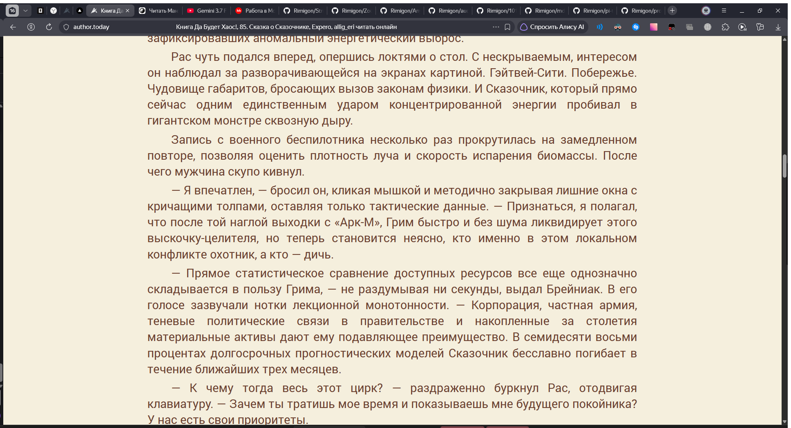

# Просмотр — современный просмотрщик фото и видео для Windows 11

Нативное приложение в стиле «Фотографии» Windows 11, но быстрее и удобнее: единая галерея
фото и видео, удобная навигация по папке, быстрое удаление в Корзину, полноценный видеоплеер
с **глобальной скоростью воспроизведения** по умолчанию для всех видео.



## Стек

- **WPF**, .NET 8 (`net8.0-windows`), архитектура **MVVM**
- **WPF-UI** — Fluent Design Windows 11 (Mica, тёмная/светлая/системная тема, иконки)
- **LibVLCSharp** — воспроизведение видео всех форматов (MP4, MOV, MKV, AVI, WEBM, M4V…)
  **без доустановки системных кодеков**
- **Magick.NET** — декодирование WEBP/HEIC; **XamlAnimatedGif** — анимированные GIF
- **CommunityToolkit.Mvvm**, **Microsoft.Extensions.DependencyInjection**

## Сборка и запуск

Требуется .NET 8 SDK. Платформа сборки — x64 (нативные плагины LibVLC).

```powershell
dotnet build src\Prosmotr\Prosmotr.csproj -c Debug
dotnet run   --project src\Prosmotr\Prosmotr.csproj
```

Или открыть `Prosmotr.sln` в Visual Studio 2022/2026 и нажать F5.

> ⚠️ **Любое изменение кода или XAML нужно опубликовать в папку `app\`** — иначе оно не
> попадёт в приложение, запускаемое ярлыком на рабочем столе (ярлык ведёт на `app\Prosmotr.exe`,
> а `dotnet build`/`run` собирают в `bin\…`, которую ярлык не видит). Перед публикацией закрой
> запущенные экземпляры (иначе файлы заблокированы):
>
> ```powershell
> Get-Process Prosmotr -ErrorAction SilentlyContinue | Stop-Process -Force
> dotnet publish src\Prosmotr\Prosmotr.csproj -c Release -o app
> ```

> ⚠️ Не использовать single-file publish — он ломает нативные плагины LibVLC.
> После сборки в `bin\…\net8.0-windows\libvlc\win-x64\` должны лежать `libvlc.dll`,
> `libvlccore.dll` и папка `plugins\`.

## Возможности

- **Открытие**: диалог файла/папки, drag&drop, запуск с аргументом (из ассоциации).
  При открытии файла автоматически собирается вся папка в галерею.
- **Навигация**: стрелки ←/→ (циклическая), экранные кнопки ‹ › по бокам **во всех режимах**
  (фото, видео во время воспроизведения, в окне и в полном экране), полоса миниатюр (снизу/слева),
  предзагрузка соседних фото.
- **Фото**: зум (колесо/кнопки/двойной клик), панорамирование, режимы «по размеру окна / 100% / заполнить»,
  поворот влево/вправо с опциональным сохранением в файл, анимированные GIF, WEBP/HEIC,
  копирование изображения в буфер обмена.
- **Видео**: play/pause, таймлайн, время/длительность, громкость **с усилением до 300%**, mute, выбор скорости 0.25–5×,
  индикатор скорости, автоскрытие панели, продолжение с сохранённой позиции,
  **выбор аудиодорожки**, **субтитры** (встроенные, вкл/выкл и загрузка внешнего файла),
  **сохранение кадра** в PNG рядом с видео.
- **Скорость**: глобальная по умолчанию (сохраняется) + локальная для текущего видео;
  опция «запоминать скорость для файла».
- **Удаление**: кнопка / Delete → в Корзину (или навсегда), подтверждение настраивается,
  авто-переход к следующему, уведомление с кнопкой **«Отменить»**.
- **Восстановление удаления**: кнопка в панели (или «Отменить» в уведомлении) возвращает
  последний удалённый в Корзину файл на его место в галерее.
- **Уведомления**: каждое действие (удаление, копирование, ошибка) сопровождается всплывающим
  тостом — в т.ч. поверх видео.
- **Доп. действия**: показать в проводнике, копировать путь, **открыть с помощью…**,
  **свойства файла** (в окне приложения: имя, путь, тип, размер, даты, размеры фото или
  разрешение/длительность/частота кадров видео), слайд-шоу.
- **Контекстное меню** (правый клик) — все действия под рукой: для видео — аудиодорожка,
  субтитры, скорость, кадр; для фото — поворот, масштаб, копирование; плюс навигация,
  удаление/восстановление, проводник, свойства, полный экран.
- **Настройки** (в `%APPDATA%\Prosmotr\settings.json`): скорость, удаление, тема, миниатюры,
  автоскрытие, запуск, слайд-шоу, интеграция с Windows.

## Горячие клавиши

| Клавиша | Действие |
|---|---|
| ← / → | Предыдущий / следующий файл |
| Delete | Удалить файл |
| F | Полноэкранный режим |
| Esc | Выйти из полноэкранного режима |
| Пробел | Видео: воспроизведение/пауза |
| M | Видео: звук вкл/выкл |
| ↑ / ↓ | Видео: громкость |
| `[` `]` или `-` `+` | Видео: скорость |

## Хранение данных

- `%APPDATA%\Prosmotr\settings.json` — настройки и недавние файлы
- `%LOCALAPPDATA%\Prosmotr\positions.json` — позиции воспроизведения видео (resume)
- `%LOCALAPPDATA%\Prosmotr\app.log`, `startup.log` — диагностические логи

## Замечания

- **Приложение по умолчанию.** Windows 11 запрещает программно назначать приложение по умолчанию
  (защита UCPD/UserChoiceLatest). «Просмотр» регистрирует ProgID в `HKCU` (пункт «Открыть с помощью»),
  а кнопка в настройках открывает системные «Приложения по умолчанию», где выбор подтверждается вручную.

## Структура проекта

```
src/Prosmotr/
  App.xaml(.cs)           — точка входа, DI-контейнер
  Models/                 — MediaItem, AppSettings, перечисления и т.п.
  Services/               — библиотека, навигация, удаление, настройки, тема, видео (LibVLC),
                            декодирование, миниатюры, ассоциации, позиции воспроизведения
  ViewModels/             — MainViewModel + по VM на каждый экран
  Views/                  — MainWindow, EmptyState, ImageViewer, VideoViewer (оверлей поверх видео),
                            ThumbnailStrip, SettingsWindow, Controls/ZoomBorder
  Converters/, Infrastructure/, Resources/
```
